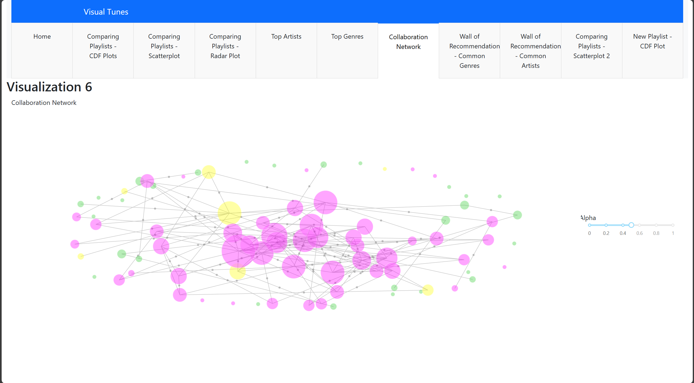

# Spotify Playlist Analysis and Recommendation Dashboard

This project aims to leverage Spotify data to compare and analyze two playlists. It identifies common trends and recommends new songs through various visualizations. The main goal is to provide an interactive dashboard that helps users understand their music tastes and discover new music based on shared interests.

## Dashboard Link

## You can access the interactive dashboard [LINK](https://spotify-dash-mzem5f6vra-ue.a.run.app/).

## Visualizations

### Static Visuals

1. **Scatterplot**: Compares song durations between the two playlists.
2. **Histogram**: Shows the distribution of song durations.
3. **Parallel Coordinate Plots**: Compares song features across different popularity levels.
4. **Treemaps**: Represents the genre distribution of artists.
5. **Word Clouds**: Shows the most common music genres.
6. **Radar Chart**: Compares mean values of selected song features.
7. **Violin Plot**: Compares the distribution of song popularity.
8. **Box Plot**: Visualizes the distribution of song durations across genres.

### Interactive Visuals

1. **Cumulative Distribution Plot**: Compares various numerical continuous variables.
2. **Dynamic Scatterplot**: Allows users to control the variables on axes and the size of scatter points.
3. **Bubble Chart**: Shows top genres by count in both playlists.
4. **Network Map**: Displays artist collaborations.
5. **Treemaps for Recommendations**: Shows top new recommended songs from common genres and artists.
6. **Interactive Scatterplot for New Playlist**: Visualizes songs from the new playlist with user-controlled variables.

   

  
       
  

   
