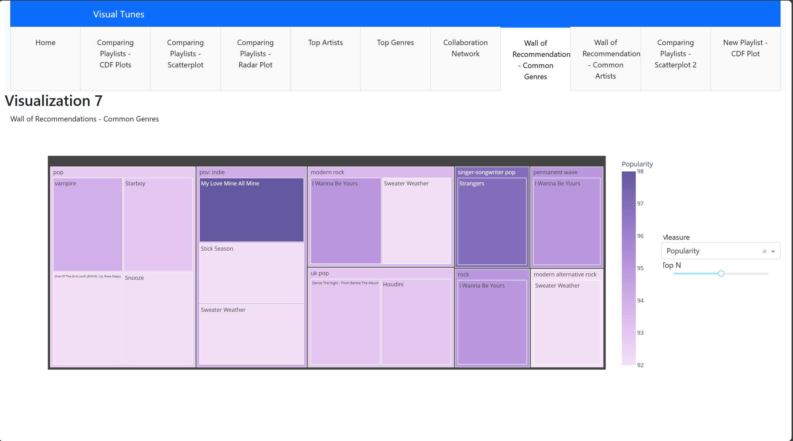

# [Spotify Playlist comparison, analysis and Recommendation Dashboard](https://spotify-dash-mzem5f6vra-ue.a.run.app/)

## Overview
This project leverages Spotify data to compare and analyze two different playlists, exploring their similarities and differences. By utilizing various visualizations, the aim is to identify common trends and provide listeners with tailored recommendations for new songs. The primary goal is to create an interactive dashboard that helps users understand their music tastes and discover new music based on shared interests.

## Dataset
The dataset is sourced from Spotify's API, capturing details about tracks, artists, genres, and various musical attributes such as popularity, tempo, and energy. Key columns include:
- Track Name
- Artist(s)
- Genres
- Song Popularity
- Energy
- Acousticness
- Valence

## Data Architecture
A pipeline is established to gather playlist hyperlinks, extract playlist data from Spotify, and perform comparative analysis. This architecture facilitates seamless data retrieval and analysis, allowing for efficient exploration of musical attributes.

## Tools Used
- Python (Pandas, NumPy)
- Data Visualization Libraries (Matplotlib, Seaborn, Plotly)
- Spotify API
- Jupyter Notebook for analysis and visualization

## Methods
### Algorithms
- Linear Regression for trend analysis
- K-means Clustering for grouping similar tracks

### Results
1. **Cumulative Distribution Plots**: Visualizes the distribution of numerical attributes in the playlists.
2. **Scatterplots**: Allows users to compare songs from both playlists based on selected variables.
3. **Radar Plots**: Compares average values of musical attributes across playlists.
4. **Bubble Charts**: Displays top artists and genres by count, illustrating their presence in the playlists.
5. **Network Maps**: Shows artist collaborations to uncover relationships within the playlists.
6. **Treemaps**: Highlights new recommended songs from common genres and artists.
7. **Interactive Features**: Includes sliders for dynamic data visualization and hover effects for additional information.

   

  
       
  

   

## Outcome
The project results in an interactive dashboard that enables users to compare playlists, gain insights into their music tastes, and receive personalized recommendations based on shared interests. The focus is on creating meaningful and aesthetically pleasing visualizations that enhance the user experience.

<h2> <b>Refer to Report.pdf and Presentation.pptx files for more details</b>b</h2>
